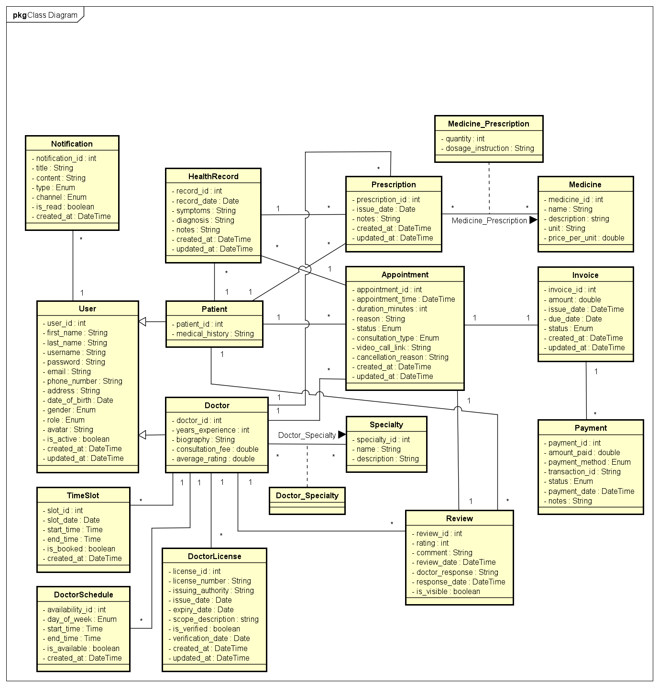
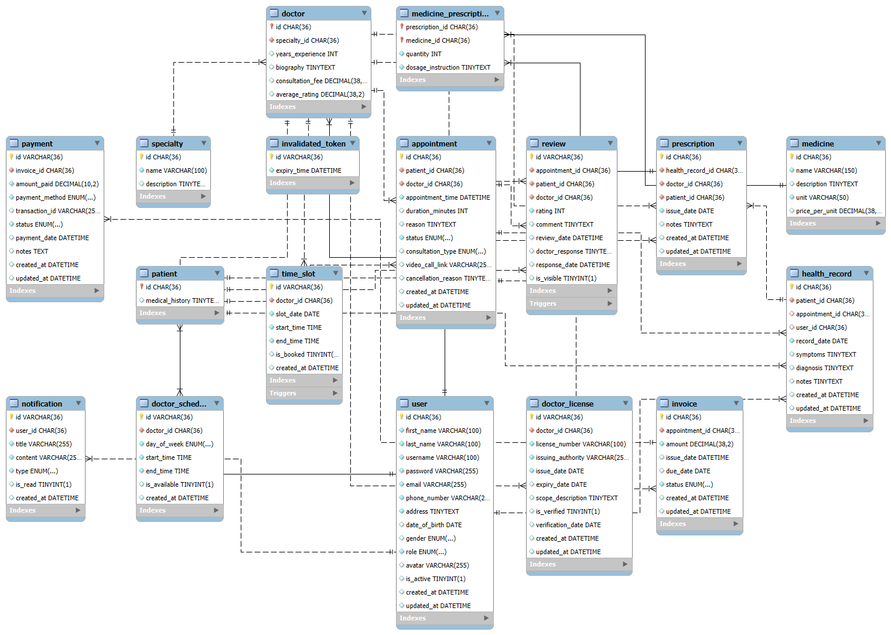

<!-- Project Logo -->
<p align="center">
  
  
</p>

<!-- Badges -->
<p align="center">
  
  
  
  
  
  
  
</p>

# Haubookingcare Clinic System

A website for private clinic management: online appointment booking, electronic payment,
real-time messaging and chat, medical record management, diagnosis and prescription, and statistical reporting, and more.

---

# 💻System Architecture
<p align="center">
  
</p>

---

## Table of Contents
- [Key Highlights](#key-highlights)
- [Features](#features)
- [Technology Stack](#technology-stack)
- [Project Structure](#project-structure)
- [Getting Started](#getting-started)
- [Firebase Cloud Functions](#firebase-cloud-functions-for-chat-notifications)
- [Database](#database)
- [Diagrams & Documentation](#diagrams--documentation)
- [Contact](#contact)
- [License](#license)

---

<p align="center">
  
  
</p>

---

## Key Highlights

### Backend (Spring Boot)
- **RESTful API Architecture:** Clear separation of controller, service, repository, DTO, and entity layers.
- **JWT Security:** Authentication and role-based authorization (patient, doctor, admin).
- **Firebase Cloud Messaging:** Real-time notifications for appointments and chat.
- **Electronic Payment Integration:** Supports VNPay and PayPal for online payments.
- **Comprehensive Clinic Management:** Handles appointments, invoices, prescriptions, health records, and doctor licensing.
- **Cloudinary Integration:** Secure image upload for doctor licenses and patient records.
- **Automated Email Service:** Sends appointment confirmations and payment notifications.
- **Centralized Exception Handling:** Global error management for robust APIs.
- **Scheduled Tasks:** Automated cleanup (e.g., expired tokens), reminders.
- **Performance Optimization:** Redis caching, efficient pagination for large datasets.
- **Unit & Integration Testing:** (Add details if you have test coverage.)

### Frontend (React)
- **State Management:** Uses Context API and Reducer for user/session state.
- **Multi-language Support:** i18next for internationalization (Vietnamese/English).
- **Real-time Chat:** Patient-doctor chat via Firebase.
- **Appointment Management:** Book, update, cancel with OTP/email verification.
- **Online Payment UI:** Choose payment method, handle callbacks, and display invoices.
- **Profile & Medical Record Management:** For both patients and doctors.
- **Doctor Review & Rating:** Patients can review and rate doctors.
- **Responsive Design:** Mobile and desktop friendly.
- **User Experience:** Toast notifications, loading indicators, form validation, error handling.
- **AI Integration:** (If you have chatbot or AI features, mention here.)

### DevOps & Documentation
- **Dockerized Deployment:** Backend and frontend are containerized for easy deployment.
- **Comprehensive Diagrams:** Class, ERD, Use Case, Activity, Sequence diagrams included.
- **Detailed Documentation:** Step-by-step setup, configuration, and extension guides.
- **API Ready for Mobile App:** Well-structured REST API for future mobile integration.

---

## Features

- **User Management:** Register, login, profile management, password change
- **Doctor Management:** Search, book appointments, view schedules, review doctors
- **Online Booking:** Book, update, and manage appointments
- **Real-time Chat:** Patient-doctor chat using Firebase
- **Notifications:** Push notifications via Firebase Cloud Messaging
- **Payment:** Online payment and invoice management
- **Medicine Management:** View and manage medicines
- **Health Records:** Manage and view patient health records
- **Admin Panel:** Manage doctors, licenses, specialty, medicines, reports, etc.

## Technology Stack

### Backend
- Java 21, Spring Boot 3
- MySQL (JPA/Hibernate)
- Cloudinary (image upload)
- Email SMTP (Gmail)
- Docker (multi-stage build)

### Frontend
- React 19, React Router, Bootstrap
- Firebase (authentication, Firestore, messaging)
- Axios, i18next (multi-language), PeerJS (video call)
- Real-time chat and notifications

## Project Structure

```
Backend/Clinic_Management/   # Spring Boot backend
Frontend/clinic_management/  # React frontend
```

## Getting Started

### Prerequisites
- Java 21+
- Node.js & npm (or yarn)
- MySQL database
- Docker (optional, for containerization)
- Firebase project (for chat/notifications)
- Cloudinary account (for image upload)

### Backend Setup
1. Configure environment variables in `application.properties` (see sample below):
   ```properties
   spring.datasource.url=jdbc:mysql://localhost:3306/clinicdb
   spring.datasource.username=your_db_user
   spring.datasource.password=your_db_password
   spring.mail.username=your_gmail@gmail.com
   spring.mail.password=your_gmail_app_password
   cloudinary.cloud_name=your_cloud_name
   cloudinary.api_key=your_api_key
   cloudinary.api_secret=your_api_secret
   ```
2. Build and run with Maven:
   ```bash
   cd Backend/Clinic_Management
   mvn clean package
   java -jar target/*.jar
   ```
   Or use Docker:
   ```bash
   docker build -t clinic-backend .
   docker run -p 8080:8080 clinic-backend
   ```

### Frontend Setup
1. Install dependencies:
   ```bash
   cd Frontend/clinic_management
   npm install
   # or
   yarn install
   ```
2. Configure Firebase in `src/configs/FirebaseConfigs.js` and other configs as needed.
3. Start the app:
   ```bash
   npm start
   # or
   yarn start
   ```
   The app runs at [http://localhost:3000](http://localhost:3000)

## Firebase Cloud Functions for Chat Notifications
- See `Frontend/clinic_management/functions/index.js` for cloud function code.
- Deploy with Firebase CLI if needed.

## Database
- See `clinicdb.sql` for the database schema.

## Diagrams & Documentation
- See `/image`, `/Sequence_Diagram`, `/Activity_Diagram` for diagrams and documentation.

## Contact
- **Author:** Nguyen Trung Hau
- **Email:** trunghauu71@gmail.com
- **GitHub:** [Hauharu](https://github.com/Hauharu)

## License
This project is for educational purposes.

---

> _Feel free to contribute or open issues for suggestions and improvements!_
